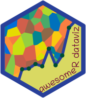

# awesome-r-dataviz 

> Curated resources for Data Visualization, Drawing & Publishing in R.

## ggplot

### Additional Plot Types
* [waffle](https://github.com/hrbrmstr/waffle) - Make waffle (square pie) charts in R.
* [ggridges](https://github.com/clauswilke/ggridges) - Geoms to make ridgeline plots with ggplot2.
* [ggchicklet](https://github.com/hrbrmstr/ggchicklet) - Create Chicklet (Rounded Segmented Column) Charts.
* [ggdendro](https://github.com/andrie/ggdendro) - Tools to extract dendrogram plot data for use with ggplot.
* [ggcorrplot](https://github.com/kassambara/ggcorrplot) - Visualization of a correlation matrix using ggplot2. [[Tutorial]](http://www.sthda.com/english/wiki/ggcorrplot-visualization-of-a-correlation-matrix-using-ggplot2)
* [corrgram](https://github.com/kwstat/corrgram) -  A simple way to create correlograms from raw data or a correlation matrix.
* [ggradar](https://github.com/ricardo-bion/ggradar) - Radar charts with ggplot2 .
* [ggparty](https://github.com/martin-borkovec/ggparty) - ggplot2 visualizations for the [partykit](http://partykit.r-forge.r-project.org/partykit/) package.
* [ggmosaic](https://github.com/haleyjeppson/ggmosaic) - Mosaicplots in the ggplot2 framework.
* [ggbeeswarm](https://github.com/eclarke/ggbeeswarm) - Column scatter / beeswarm-style plots in ggplot2.
* [ggvoronoi](https://github.com/garretrc/ggvoronoi) - Easy Voronoi diagram heatmaps with ggplot2.
* [ggTimeSeries](https://github.com/shrektan/ggTimeSeries) - Taking time series visualisations beyond line charts.
* [ggupset](https://github.com/const-ae/ggupset) - Combination matrix axis for 'ggplot2' to create 'UpSet' plots.
* [UpSetR](https://github.com/hms-dbmi/UpSetR) - An R implementation of the UpSet set visualization technique published by Lex, Gehlenborg, et al.
* [complex-upset](https://github.com/krassowski/complex-upset) - A library for creating complex UpSet plots with ggplot2 geoms.
* [patternplot](https://cran.rstudio.com/web/packages/patternplot/index.html) -  Versatile Pie Charts, Bar Charts and Box Plots using Patterns, Colors and Images. [[Vignette]](https://cran.rstudio.com/web/packages/patternplot/vignettes/patternplot-intro.html)
* [ggstance](https://github.com/lionel-/ggstance) - Horizontal ggplot2 components.
* [ggthreed](https://github.com/coolbutuseless/ggthreed) - 3d geoms and stats for ggplot.
* [gggibbous](https://github.com/mnbram/gggibbous) - Moon charts, a pie chart alternative, for ggplot2.
* [ggweekly](https://github.com/gadenbuie/ggweekly) - Easy, printable, custom calendars and week planners.
* [gghdr](https://github.com/ropenscilabs/gghdr) -  Tools for plotting highest density regions in the ggplot2.
* [ggpointdensity](https://github.com/LKremer/ggpointdensity) - Cross Between a Scatter Plot and a 2D Density Plot.
* [ggstraw](https://github.com/nacnudus/ggstraw) - geom_straw for ggplot2.
* [ggVennDiagram](https://github.com/gaospecial/ggVennDiagram) - A 'ggplot2' implement of Venn Diagram.
* [ggblur](https://github.com/coolbutuseless/ggblur) - Blurry Point Geom for ggplot2.
* [ggbump](https://github.com/davidsjoberg/ggbump) - A geom for ggplot to create bump plots.
* [marginsplot](https://github.com/vincentarelbundock/marginsplot) - plot marginal effects and predicted values using the `margins` and `ggplot2`.
* [ggimg](https://github.com/statsmaths/ggimg) - The Missing Image Primative for ggplot2.
* [ggpattern](https://github.com/coolbutuseless/ggpattern/) - ggplot geoms with pattern fills.
* [ggfreehand](https://github.com/dgrtwo/ggfreehand) - Add freehand circles to ggplot2 graphs.
* [ganttrify](https://github.com/giocomai/ganttrify) - Create beautiful Gantt charts with ggplot2.

### Themes
* [ggthemr](https://github.com/cttobin/ggthemr) - Themes for ggplot2.
* [ggthemes](https://github.com/jrnold/ggthemes) - Additional themes, scales, and geoms for ggplot2.
* [ggpomological](https://github.com/gadenbuie/ggpomological) - Pomological plot theme for ggplot2 .
* [ggtech](https://github.com/ricardo-bion/ggtech) - ggplot2 tech themes, scales, and geoms .
* [hrbrthemes](https://github.com/hrbrmstr/hrbrthemes) - Opinionated, typographic-centric ggplot2 themes and theme components.
* [vapoRwave](https://github.com/moldach/vapoRwave) - Vaporwave themes and color palettes for ggplot2.
* [tvthemes](https://github.com/Ryo-N7/tvthemes) - ggplot2 themes and palettes based on your favorite TV shows.
* [Rokemon](https://github.com/schochastics/Rokemon) - Pokemon themed R package.
* [visibly](https://github.com/m-clark/visibly) - Functions related to R visualizations.
* [xkcd](http://xkcd.r-forge.r-project.org/) - Graphs using the XKCD style (a webcomic of romance, sarcasm, math, and language). [[Tutorial]](https://github.com/cran/xkcd/blob/master/inst/doc/xkcd-intro.pdf)
* [ggrough](https://github.com/xvrdm/ggrough) - Convert ggplot2 chart to roughjs.
* [ggCorpIdent](https://github.com/INWTlab/ggCorpIdent) - A package for ggplot2 graphics in corporate design with custom fonts, colors and logo. [[Tutorial]](https://www.inwt-statistics.com/read-blog/ggcorpident.html)

### Palettes 🎨
* [paletteer](https://github.com/EmilHvitfeldt/paletteer) - Collection of most color palettes in a single R package.
* [randomcoloR](https://github.com/ronammar/randomcoloR) - An R package for generating attractive and distinctive colors.
* [fishualize](https://github.com/nschiett/fishualize) - Color scales based on nature’s most stunning and colorful organisms: teleost fishes.
* [harrypotter](https://github.com/aljrico/harrypotter) - A Harry Potter inspired palette for R.
* [wesanderson](https://github.com/karthik/wesanderson) - A Wes Anderson color palette for R.
* [nationalparkcolors](https://github.com/katiejolly/nationalparkcolors) - R package for color themes inspired by national parks.
* [dutchmasters](https://github.com/EdwinTh/dutchmasters) - Colour palettes derived from famous paintings by 17th century Dutch masters.
* [pals](https://github.com/kwstat/pals) - Color Palettes and Palette Evaluation Tools.
* [jcolors](https://github.com/jaredhuling/jcolors) - A set of color palettes I like (or can at least tolerate).
* [shades](https://github.com/jonclayden/shades) - Simple colour manipulation in R. [[Tutorial]](https://hughjonesd.github.io/tweaking-colours-with-the-shades-package.html)
* [colorspace](http://colorspace.r-forge.r-project.org/index.html) - A toolbox for manipulating and assessing colors and palettes.
* [tinter](https://github.com/poissonconsulting/tinter) - Get tints and shades (and both) of a colour.
* [colormind](https://github.com/dmi3kno/colormind) - Generate Color Palettes With AI (using colormind.io palette generator).
* [farver](https://github.com/thomasp85/farver) - High Performance Colourspace Manipulation in R.
* [tricolore](https://github.com/jschoeley/tricolore) - A flexible color scale for ternary compositions.
* [colorfindr](https://github.com/zumbov2/colorfindr) - Extracts colors from various image types, plots treemaps and 3D scatterplots.

### Domain-specific
* [ggparliament](https://github.com/RobWHickman/ggparliament) - Simple parliament plots using ggplot2.
* [ggsoccer](https://github.com/Torvaney/ggsoccer) - Plot soccer event data in R/ggplot2.
* [soccermatics](https://github.com/JoGall/soccermatics) - Tools for visualisation and analysis of soccer tracking and event data.
* [gganatogram](https://github.com/jespermaag/gganatogram) - Create anatograms using ggplot2.
* [rchess](https://github.com/jbkunst/rchess) - Chess package for R.
* [brickr](https://github.com/ryantimpe/brickr) - 3D LEGO models and mosaics from images using R and tidyverse.
* [desplot](https://github.com/kwstat/desplot) - Functions for plotting experimental designs of field trials in agriculture.
* [kinship2](https://github.com/sinnweja/kinship2) - Pedigree creation, plotting, and analytics. [[Vignette]](https://cran.r-project.org/web/packages/kinship2/vignettes/pedigree.html)
* [GeomMLBStadiums](https://github.com/bdilday/GeomMLBStadiums) - Geoms to draw MLB stadiums in ggplot2.
* [ggpacman](https://github.com/mcanouil/ggpacman) - A `ggplot2` and `gganimate` Version of Pac-Man.
* [gglcd](https://github.com/cj-holmes/gglcd) - About
Programmatic production of Liquid Crystal alignment diagrams.

### Text
* [ggtext](https://github.com/wilkelab/ggtext) - Improved text rendering support for ggplot2.
* [wordcloud2](https://github.com/Lchiffon/wordcloud2) - R interface to wordcloud for data visualization.
* [ggrepel](https://github.com/slowkow/ggrepel) - Repel overlapping text labels away from each other.
* [shadowtext](https://github.com/GuangchuangYu/shadowtext) - Shadow Text Grob and Layer. [[Vignette]](https://cran.r-project.org/web/packages/shadowtext/vignettes/shadowtext.html)

### Animations
* [gganimate](https://github.com/thomasp85/gganimate) - A Grammar of Animated Graphics.
* [animation](https://github.com/yihui/animation) - A gallery of animations in statistics and utilities to create animations.
* [tweenr](https://github.com/thomasp85/tweenr) - A package for interpolating data, mainly for animations.
* [transformr](https://github.com/thomasp85/transformr) - Smooth Polygon Transformations.

### Devices
* [Cairo](http://www.rforge.net/Cairo/) - Graphics device using cairographics library for creating bitmap images or output.
* [devout](https://github.com/coolbutuseless/devout) - Write R graphics output devices in plain R.
* [devoutsvg](https://github.com/coolbutuseless/devoutsvg) - Bespoke SVG graphics output device with pattern fill support.
* [devoutpdf](https://github.com/coolbutuseless/devoutpdf) - A hand-crafted PDF graphics output device written in plain R.
* [devoutaudio](https://github.com/coolbutuseless/devoutaudio) - An R graphics device which renders to audio.
* [devoid](https://github.com/r-lib/devoid) - A Graphic Device That Does Nothing (suitable for benchmarking functions).
* [devoutrgl](https://github.com/coolbutuseless/devoutrgl) - R graphics device to render to {rgl}.

### Miscellaneous
* [ggpmisc](https://cran.rstudio.com/web/packages/ggpmisc/) - Miscellaneous Extensions to `ggplot2`.
* [ggExtra](https://github.com/daattali/ggExtra) - Marginal histograms to ggplot2, and more ggplot2 enhancements.
* [ggreverse](https://github.com/coolbutuseless/ggreverse) - Reverse a ggplot object back into code.
* [datalegreyar](https://github.com/emitanaka/datalegreyar) - The typeface that melts text and data visualisation for R markdown.
* [dbplot](https://github.com/edgararuiz/dbplot) - Simplifies plotting of database and sparklyr data.
* [ggalt](https://github.com/hrbrmstr/ggalt) - Extra Coordinate Systems, Geoms, Statistical Transformations & Scales for 'ggplot2'.
* [ggpubr](https://github.com/kassambara/ggpubr) - 'ggplot2' Based Publication Ready Plots.
* [patchwork](https://github.com/thomasp85/patchwork) - The Composer of ggplots.
* [ggally](https://github.com/ggobi/ggally) - R package that extends ggplot2. [[Tutorial]](http://www.sthda.com/english/wiki/ggally-r-package-extension-to-ggplot2-for-correlation-matrix-and-survival-plots-r-software-and-data-visualization)
* [ggforce](https://github.com/thomasp85/ggforce) - Accelerating ggplot2. [[Tutorial 1]](https://www.data-imaginist.com/2019/the-ggforce-awakens-again/) [[Tutorial 2]](https://rviews.rstudio.com/2019/09/19/intro-to-ggforce/)
* [gghighlight](https://github.com/yutannihilation/gghighlight) - Highlight points and lines in ggplot2.
* [ggnomics](https://github.com/teunbrand/ggnomics) - A small project to add ggplot2 extensions.
* [facetscales](https://github.com/zeehio/facetscales) - facet_grid with different scales per facet.
* [ggflags](https://github.com/ellisp/ggflags) - flag geom for ggplot2.
* [ggecho](https://github.com/coolbutuseless/ggecho) - ggplot2 stat for echoing data.
* [ggfx](https://github.com/thomasp85/ggfx) - Filters and Shaders for 'ggplot2'.
* [ggboy](https://github.com/cj-holmes/ggboy) - Simulating Game Boy DMG-01 graphics.
* [ggframe](https://github.com/moodymudskipper/ggframe) - data frames that print as ggplots.

## Interactive plots
* [plotly](https://github.com/ropensci/plotly) - An interactive graphing library for R.
* [rbokeh](https://github.com/bokeh/rbokeh) - R interface to Bokeh.
* [ggiraph](https://github.com/davidgohel/ggiraph) - Make 'ggplot' graphics interactive.
* [highcharter](https://github.com/jbkunst/highcharter) - R wrapper for highcharts based on htmlwidgets.
* [dygraphs](https://github.com/rstudio/dygraphs) - R interface to dygraphs.
* [rCharts](https://github.com/ramnathv/rCharts) - Interactive JS Charts from R.
* [billboarder](https://github.com/dreamRs/billboarder) - R Htmlwidget for billboard.js.
* [scatterD3](https://github.com/juba/scatterD3) - R scatter plot htmlwidget based on D3.js.
* [trelliscopejs](https://github.com/hafen/trelliscopejs) - TrelliscopeJS R Package.
* [googleVis](https://github.com/mages/googleVis) - Interface between R and the Google Chart Tools.

## Network Visualization
* [geomnet](https://github.com/sctyner/geomnet) - Network Visualization in the ggplot2 Framework.
* [graphlayouts](https://github.com/schochastics/graphlayouts) - New layout algorithms for network visualizations in R.
* [visNetwork](https://github.com/datastorm-open/visNetwork) - R package, using vis.js library for network visualization.
* [ggraph](https://github.com/thomasp85/ggraph) - Grammar of Graph Graphics.
* [ggdag](https://github.com/malcolmbarrett/ggdag) - An R package for working with causal directed acyclic graphs (DAGs).

## Spatial Visualization
* [ggmap](https://github.com/dkahle/ggmap) - A package for plotting maps in R with ggplot2.
* [tmap](https://github.com/mtennekes/tmap) - R package for thematic maps.
* [leaflet](https://github.com/rstudio/leaflet) - R Interface to Leaflet Maps.
* [globe4r](https://github.com/JohnCoene/globe4r) - Interactive globe visualisations.
* [urbnmapr](https://github.com/UrbanInstitute/urbnmapr) - State and county maps with Alaska and Hawaii.
* [cartography](https://github.com/riatelab/cartography) - Thematic Cartography. [[Vignette]](https://cran.r-project.org/web/packages/cartography/vignettes/cartography.html)
* [mapextrud](https://github.com/neocarto/mapextrud) - Build Extruded Maps in R.
* [geofacet](https://hafen.github.io/geofacet/) - R package for geographical faceting with ggplot2.

## Tables
* [formattable](https://github.com/renkun-ken/formattable) - Formattable Data Structures.
* [kableExtra](https://github.com/haozhu233/kableExtra) - Construct Complex Table with knitr::kable() + pipe.
* [gt](https://github.com/rstudio/gt) - Easily generate information-rich, publication-quality tables from R.
* [DT](https://github.com/rstudio/DT) - R Interface to the jQuery Plug-in DataTables.

## Publishing 
* [blogdown](https://github.com/rstudio/blogdown) - Create Blogs and Websites with R Markdown.
* [bookdown](https://github.com/rstudio/bookdown) - Authoring Books and Technical Documents with R Markdown.
* [posterdown](https://github.com/brentthorne/posterdown) - Use RMarkdown to generate PDF Conference Posters via HTML.

## Drawing & Rendering
* [magick](https://github.com/ropensci/magick) - Advanced Image-Processing in R. [[Tutorial]](https://cran.r-project.org/web/packages/magick/vignettes/intro.html)
* [bunny](https://github.com/dmi3kno/bunny) - Useful helper functions for working with magick.
* [threed](https://github.com/coolbutuseless/threed) - Three-Dimensional Object Transformations.
* [svgpatternusgs](https://github.com/coolbutuseless/svgpatternusgs) - SVG patterns from the U.S. Geological Survey for use within R.
* [ggtextures](https://github.com/clauswilke/ggtextures) - Drawing textured rectangles and bars with ggplot.
* [rayshader](https://github.com/tylermorganwall/rayshader) - R Package for 2D and 3D mapping and data visualization.
* [rayrender](https://github.com/tylermorganwall/rayrender) - A raytracer for R. Based on Peter Shirley's "Ray Tracing in One Weekend" book series. 
* [rayfocus](https://github.com/tylermorganwall/rayfocus) - Add depth of field to images.
* [rayshaderanimate](https://github.com/zappingseb/rayshaderanimate) - Animate GPX data on a 3D map.

## Others
* [lattice](https://github.com/deepayan/lattice) - High-level data visualization system inspired by Trellis graphics,.
* [latticeExtra](http://latticeextra.r-forge.r-project.org/) - Extensions for lattice package.

## Learning

### Tutorials
* [Be Awesome in ggplot2: A Practical Guide to be Highly Effective - R software and data visualization.](http://www.sthda.com/english/wiki/be-awesome-in-ggplot2-a-practical-guide-to-be-highly-effective-r-software-and-data-visualization) 
* [A ggplot2 Tutorial for Beautiful Plotting in R](https://cedricscherer.netlify.com/2019/08/05/a-ggplot2-tutorial-for-beautiful-plotting-in-r/)
* [A pole vaulting example](http://eriqande.github.io/rep-res-web/lectures/ggplot_1_pole_vault_example.html)
* [The Evolution of a ggplot](https://cedricscherer.netlify.com/2019/05/17/the-evolution-of-a-ggplot-ep.-1/)
* [Introduction to Network Analysis with R. Creating static and interactive network graphs](https://www.jessesadler.com/post/network-analysis-with-r/)

### Books
* [Data Visualization with R](https://rkabacoff.github.io/datavis/) by Rob Kabacoff.
* [Data Visualization. A practical introduction](https://socviz.co/) by Kieran Healy.
* [Circular Visualization in R](https://jokergoo.github.io/circlize_book/book/index.html) by Zuguang Gu.
* [Fundamentals of Data Visualization](https://serialmentor.com/dataviz/index.html) by Claus O. Wilke.
* [Geocomputation with R: Chapter 8 Making maps with R](https://geocompr.robinlovelace.net/adv-map.html) by Robin Lovelace, Jakub Nowosad and Jannes Muenchow.
* [Essentials of color in R from. Chapter from Data Science for Psychologists](https://bookdown.org/hneth/ds4psy/D-2-apx-colors-essentials.html) by Hansjörg Neth

### How to...?

#### Plots
* Create infographics in R
   * [Create infographics with R](https://www.listendata.com/2019/06/create-infographics-with-r.html)
   * [How to Layout and Design an Infographic](https://alstatr.blogspot.com/2015/02/r-how-to-layout-and-design-infographic.html)
   * [How to Create Infographics in R](http://nandeshwar.info/data-visualization/how-to-create-infographics-in-r/)
* [Plot wind directions with arrows](https://stackoverflow.com/questions/47880918/how-to-plot-wind-direction-with-lat-lon-and-arrow-in-ggplot2)
* [Plot Bump Chart](https://luisdva.github.io/rstats/dog-bump-chart/)
* Fill area with an image
    * [Use an image as area fill in an R plot (StackOverflow)](https://stackoverflow.com/questions/45777519/use-an-image-as-area-fill-in-an-r-plot)
    * [Overlay de imagenes sobre areas en ggplot (in Spanish)](https://pmoracho.github.io/blog/2017/09/01/Overlay-imagen-sobre-ggplot/)
* [Add custom fonts to ggplot](http://gradientdescending.com/adding-custom-fonts-to-ggplot-in-r/)
* [Add images to the plot](https://buzzrbeeline.blog/2018/06/13/fun-and-easy-r-graphs-with-images/)
* [Plot Bubble Packed Chart](https://chichacha.netlify.com/2018/12/22/bubble-packed-chart-with-r-using-packcircles-package/) 
* [Create waterfall chart with ggplot2](https://anhhoangduc.com/blog/create-waterfall-chart-with-ggplot2/)
* [Make xkcd style graphs](https://stackoverflow.com/questions/12675147/how-can-we-make-xkcd-style-graphs)
* [Visualize Self-Organizing Map](http://blog.schochastics.net/post/soms-and-ggplot/)
* [Use emojis as scatterplot points](https://statisticaloddsandends.wordpress.com/2018/12/28/using-emojis-as-scatterplot-points/)
* [Make calendar with ggplot](https://chichacha.netlify.com/2018/05/26/making-calendar-with-ggplot-moon-phase-calendar/)
* [Drawing a basketball court with R](https://egallic.fr/en/drawing-a-basketball-court-with-r/)
* [Draw a Gantt chart](https://stackoverflow.com/questions/3550341/gantt-charts-with-r)

#### Maps
* [Connections on the map](https://flowingdata.com/2011/05/11/how-to-map-connections-with-great-circles/) [[remarks]](https://paulbutler.org/2010/visualizing-facebook-friends/)
* [3D Lego Map and visualize Columbus Voyage - Rayshade rWalkthrough [GIF]](https://arthurwelle.github.io/RayshaderWalkthrough/index.html)
* [Subplots in maps with ggplot2](https://ikashnitsky.github.io/2017/subplots-in-maps/)
* [Bivariate maps with ggplot2 and sf](https://timogrossenbacher.ch/2019/04/bivariate-maps-with-ggplot2-and-sf/)

#### Drawing
* Create hex sticker
  * [Making hex and twittercard with bunny and magick](https://www.ddrive.no/post/making-hex-and-twittercard-with-bunny-and-magick/)
  * [gganimate your hex](https://www.ddrive.no/post/gganimate-your-hex/)
* [Draw Animated TIE Fighter](https://www.wjakethompson.com/post/2018-05-04-animated-tie-fighter/)
* [Making an animated contour plot](https://www.wjakethompson.com/post/2018-09-05-animated-contour-plot/)
* [Draw a clock](https://www.wjakethompson.com/post/2018-11-27-ggclock/)

### Animations
* [Download and Animate Polar Ice Data in R with Rayrender](https://www.tylermw.com/polar-ice-data-in-r-with-rayrender/)

## Inspirations

### Recreating Visualizations
* [Minard's famous plot of Napoleon's 1812 retreat from Russia](https://github.com/andrewheiss/fancy-minard) 
* [ggplot2 meets W. E. B. Du Bois - Visualizing 1900s Black American life in R.](https://www.statswithmatt.com/post/ggplot2-meets-w-e-b-du-bois/) 
* [W. E. Du Bois remakes](https://rpubs.com/ejhollowood/du-bois) by Ella Hollowood.
* [dataRbeautiful -  Recreating data visualizations from "Knowledge is Beautiful"](https://github.com/moldach/dataRbeautiful) by David McCandless.
* [Flowingdata Animated Population Chart](https://www.stevejburr.com/post/replicating-flowingdata-population-charts-in-r/) 
* [Recreate The Economist: Global Terrorism Index Plot](http://rpubs.com/tangerine/economist-plot)
* [Recreating the vaccination heatmaps in R](https://benjaminlmoore.wordpress.com/2015/04/09/recreating-the-vaccination-heatmaps-in-r/)
* [You can replicate almost any plot with R](https://simplystatistics.org/2019/08/28/you-can-replicate-almost-any-plot-with-ggplot2/)
* [Recreating the Datasaurus Dozen Using tweenr and ggplot2](https://www.wjakethompson.com/post/2017-05-05-datasaurus-dozen/)
* [RedGreenGreyDots patient flow dotplot](https://johnmackintosh.com/2017-12-21-flow/)
* [Plot recreations by mohdbilal87](https://mohdbilal87.github.io/dataviz-r/)

### Tidytuesday
* [by Karamanis](https://github.com/gkaramanis/tidytuesday)
* [by Z3tt](https://github.com/Z3tt/TidyTuesday)
* [by abichat](https://github.com/abichat/tidytuesday)

### 30 Days Map Challenge
* [by Z3tt](https://github.com/Z3tt/30DayMapChallenge)
* [by ThomasG77](https://github.com/ThomasG77/30DayMapChallenge)
* [by adam-gruer](https://github.com/adam-gruer/30DayMapChallenge)

### Art
* [Fronkonstin](https://fronkonstin.com/)
* [flametree](https://github.com/djnavarro/flametree)

### R Plot Gallery
* [The R Graph Gallery - Help and inspiration for R charts.](https://www.r-graph-gallery.com/) 
* [Top 50 ggplot2 Visualizations - The Master List (With Full R Code)](http://r-statistics.co/Top50-Ggplot2-Visualizations-MasterList-R-Code.html)
* [Data Movies and ggplot2](http://smarterpoland.pl/index.php/2018/12/data-movies-and-ggplot2/)
* [Leaders’ Ages](https://david.frigge.nz/posts/2018-11-leader-age/)
* [Regional population structures at a glance](https://github.com/ikashnitsky/the-lancet-2018)
* [Population age structures of Europe NUTS-3 regions and the US counties](https://github.com/ikashnitsky/compare-pop-eu-us)

### Other
* [Data Sketch](http://www.datasketch.es/may/) - Many inspiring data visualizations.
* [Recapping radials](http://www.storytellingwithdata.com/blog/2019/7/15/recapping-radials)
* [Beautiful Visualizations from Reddit’s DataViz Battle Competition](https://medium.com/design-and-tech-co/beautiful-visualizations-from-reddits-dataviz-battle-competition-1d058e84285c)
* [Timelines and Visual Histories](http://www.datavis.ca/gallery/timelines.php) - Historical visualizations.
* [FlowingData](https://flowingdata.com/) - Data Visualizaion ideas and tutorials, i.a. using R.
* [MakeoverMonday](https://www.makeovermonday.co.uk/gallery/) - Data Visualization weekly learning (mostly using Tableau).
